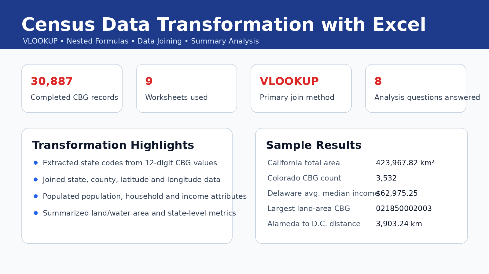

# Census Data Transformation with Excel

## Overview
This project demonstrates data transformation and lookup-based data integration in Microsoft Excel using 2016 American Community Survey census data at the Census Block Group (CBG) level.

The goal was to populate a submission template by extracting state information from CBG codes and joining geographic, demographic, household, and income attributes using Excel formulas.

## Why this project matters
This project shows practical analyst skills that are used often in real reporting work: cleaning identifiers, joining lookup tables, validating results, formatting outputs, and answering business-style questions from transformed data.

## Tools Used
- Microsoft Excel
- VLOOKUP
- Nested formulas
- SUMIF / COUNTIF / AVERAGEIF
- INDEX / MATCH
- Data formatting

## Dataset Context
The workbook uses U.S. census block group data, including:

- Census Block Group identifiers
- State and county FIPS codes
- State names
- Latitude and longitude
- Land and water area
- Population estimate
- Household estimate
- Median household income

## Main Work Completed
- Extracted the 2-character state code from each 12-digit CBG value.
- Populated state name and county name using lookup logic.
- Joined latitude, longitude, land area, and water area values.
- Added demographic attributes including population, household count, and median household income.
- Answered summary questions using formula-based analysis.
- Completed a bonus distance calculation using latitude and longitude values.

## Key Excel Techniques
Examples of techniques used in the workbook:

- `VLOOKUP` for joining data across sheets
- `LEFT`, `MID`, and `VALUE` for parsing CBG codes
- `CHOOSE` to create lookup arrays
- `SUMIF`, `COUNTIF`, and `AVERAGEIF` for summary analysis
- `INDEX` and `MATCH` to locate the CBG with the largest land area
- Trigonometric distance calculation using latitude and longitude

## Sample Results
| Question | Result |
|---|---:|
| Total land area of California | 403,501.10 km² |
| Total water area of California | 20,466.72 km² |
| Total area of California | 423,967.82 km² |
| Number of CBGs in Colorado | 3,532 |
| Average median household income for Delaware | $62,975.25 |
| CBG with largest land area | 021850002003 |
| State of largest land-area CBG | Alaska |
| Alameda County, CA to District of Columbia distance | 3,903.24 km |

## Preview

## Files Included
| File/Folder | Description |
|---|---|
| `workbook/SBA2_excel_transformation.xlsx` | Completed Excel workbook with formulas and transformed data |
| `images/excel-transformation-cover.png` | Portfolio preview image for the project |

## Project Type
Excel data transformation and formula-based analysis project.

## Note
This project was completed as a Skills Based Assessment for a Data Engineering and Integration course. It is included here to showcase Excel-based data transformation, lookup logic, and reporting preparation skills.
